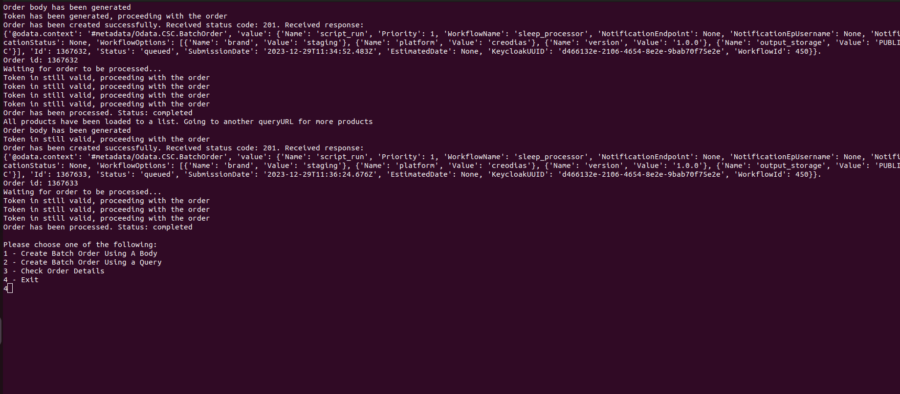

<div align="center">


<h3>Order products using /BatchOrder/OData.CSC.Order endpoint</h3>

[](https://forthebadge.com)
[](https://forthebadge.com)<br>


<br>
<a href="#about-the-script">About the script</a> •
<a href="#demo">Demo</a> •
<a href="#running-the-script-with-gui">GUI</a> •
<a href="#running-the-script-with-cron">Cron</a> •
<a href="#prerequisites">Prerequisites</a> •
<a href="#contributions">Contributions</a>

</div>

## About the script
You're looking at the script, which essentially allows you to place an order using `/odata/v1/BatchOrder`endpoint. You have 3 main options:
```
1 - Create Batch Order Using A Body
2 - Create Batch Order Using a Query
3 - Check Order Details
```
1. Use the first one if you want to place an order by hardcoding all products in `IdentifierList` parameter, specified in `order_body.json` file.
2. If you'd rather place an order by providing `queryURL`, without hardcoding products, then use option 2. The script will search for products found in `queryURL` parameter and place an order for them. Once your `parallel_quota` (which is basically a limit for a number of products per one order) will be exhausted, and order will be processed, then the new order will be placed (with remaining products in `queryURL`), provided that you set `new_orders` parameter to `true` in `env_variables.json` file. New orders will be placed till you reach your monthly quota limit or all products will be ordered. If, on the other hand, you set `new_orders` to `false`, then you will create a single order where number of products in this order will be equal to given `parallel_quota` and remaining products in `queryURL` won't be ordered.
3. Finally, you can check order details by selecting option 3. Just provide an identifier and you will see order details.

## Demo


## Running the script with GUI
In order to run the script, simply `cd` into the project folder and then type `python odata_order.py gui` in the terminal. You will be prompted with:
```
Please choose one of the following:
1 - Create Batch Order Using A Body
2 - Create Batch Order Using a Query
3 - Check Order Details
4 - Exit
```
Just choose one of the options and then script will do its magic.

## Running the script with Cron
Optionally, you can use <a href="https://www.freecodecamp.org/news/cron-jobs-in-linux/">Cron</a>, which is a utility allowing you to automatically run commands on a schedule. 

While using cron, you cannot use `odata_order.py gui`, because it simply won't work since this particular command waits for user's input. You have two options in this case: 
```
create-order-with-body   Creates BatchOrder Using Provided By User Body.
create-order-with-query  Creates BatchOrder Using Provided By User Query.
```
You can either use `odata_order.py create-order-with-body` or `odata_order.py create-order-with-query`. These two options essentially do pretty much the same thing as option 1 and option 2 from GUI, however there is one expection. In case of `odata_order.py create-order-with-query`, you can additionally provide `--hours` option, which allows you to look back in time for specific products. The script will do its thing and adjust dates in your provided query accordingly to `--hours` option.

In order to set a schedule, you can use `crontab -e` in your terminal and from there specify your cron job (in this example, the script will run at 12:51 everyday and will create BatchOrder(s) with products from the last 12 hours in your given query):
```
51 12 * * * /usr/bin/python3.11 ~/repos/odata_ordering_script/odata_order.py create-order-with-query --hours=12 > /tmp/ordering_script.log 2>&1
```
If you're not familiar with cron, that line may look a little intimidating, but it's actually pretty straightforward. There are many great tutorials on cron, so please take a look at them if you're not sure what's going on here, but for now, let's take a look at another example. In this case, the script will run at 16:14 on Mondays and will create BatchOrder(s) with all products from your given query, without modifying dates in your query:
```
14 16 * * 0 /usr/bin/python3.11 ~/repos/odata_ordering_script/odata_order.py create-order-with-query > /tmp/ordering_script.log 2>&1
```
In this example, the script will run at 11:10, on 15th day of each month and will create a single BatchOrder using your given body:
```
10 11 15 * * /usr/bin/python3.11 ~/repos/odata_ordering_script/odata_order.py create-order-with-body > /tmp/ordering_script.log 2>&1
```
In order to see logs, you can use `cat /tmp/ordering_script.log`.

## Prerequisites
1. Install all necessary libraries from `requirements.txt` file by `pip install -r requirements.txt` in your terminal.
2. Make sure to provide essential variables in `json` folder:
- no matter what, you have to provide proper parameters in `keycloak_ordering.json` and `order_body.json`
- if you'd like to place an order by providing a query, without hardcoding products, then you also have to fill `query.json`. If `queryURL` that you provided is `HDA`, then you also have to provide parameters in `keycloak_catalogue.json`
### keycloak_catalogue.json/keycloak_ordering.json
These variables that you're seeing down below are essential for keycloak authorization:
```
{
  "client_id": "",
  "username": "",
  "password": "",
  "client_secret": "",
  "keycloak_address": ""
  *"host": ""
}
```
*host is required only in `keycloak_ordering.json`, should begin with `ordering` and end with `cloudferro.com` (please do not provide `https://` at the beginning). For security reasons, I won't provide any example.
### order_body.json
`BatchOrder/OData.CSC.Order` endpoint takes following parameters in a body:
```
{
  "Name": "string",
  "Priority": 0,
  "WorkflowName": "string",
  "NotificationEndpoint": "string",
  "NotificationEpUsername": "string",
  "NotificationStatus": "string",
  "WorkflowOptions": [
    {
      "Name": "string",
      "Value": "string"
    }
  ],
  "IdentifierList": [
    "string"
  ],
  "BatchSize": 0,
  "BatchVolume": 0,
  "NotificationEpPassword": "string",
  "SendIntermediateNotifications": false
}
```
`Name` and `WorkflowName` are mandatory to create an order. `IdentifierList` is required if you'd like to use option `1 - Create Batch Order Using A Body` and hardcode all products in `IdentifierList`. If you'd rather use option `2 - Create Batch Order Using a Query`, then by all means, you can skip `IdentifierList` since the script will look for products found in a `queryURL` parameter (specified in `env_variables.json` file) and place an order for all of them. Some processors require some special parameters, so you also have to provide them. Script will give you a run-down and inform you which parameters are missing. Here's how order_body.json could possibly look like:
```
{
    "WorkflowName": "sleep_processor",
    "Name": "order_name",
   "IdentifierList": ["S1A_IW_GRDH_1SDV_20231215T054205_20231215T054230_051661_063CFA_38C9.SAFE"]
}
```
### query.json
If you'd like to create an order using a query, then you also have to provide some parameters:
```
{
    "parallel_quota": 0,
    "queryURL": "string",
    "new_orders": true
}
```
A few words about them:
- `parallel_quota` - limit for a number of products per one order
- `queryURL` - query to catalogue (datahub/HDA), can be generated from `explore.creodias.eu`
- `new_orders` - when set to true, new order will be placed with new products once the previous one was processed

Here's how it could look like:
```
{
    "parallel_quota": 5,
    "queryURL": "https://datahub.creodias.eu/odata/v1/Products?$filter=((ContentDate/Start%20ge%202023-12-28T00:00:00.000Z%20and%20ContentDate/Start%20le%202023-12-28T23:59:59.999Z)%20and%20(Online%20eq%20true)%20and%20(((((Collection/Name%20eq%20%27SENTINEL-1%27)%20and%20(((Attributes/OData.CSC.StringAttribute/any(i0:i0/Name%20eq%20%27productType%27%20and%20i0/Value%20eq%20%27SLC%27))))%20and%20(((Attributes/OData.CSC.StringAttribute/any(i0:i0/Name%20eq%20%27operationalMode%27%20and%20i0/Value%20eq%20%27WV%27)))))))))&$expand=Attributes&$expand=Assets&$orderby=ContentDate/Start%20asc&$top=20",
    "new_orders": true
}
```
### How to generate `queryURL`
You may ask yourself, how could you generate a query? Go to `explore.creodias.eu`, filter products however you wish and then click on `Copy query` right below `Search` button.
<div align="center">
  
</div>

## Contributions
Contributions are welcomed. Just create a new branch and submit pull request with extensive description of changes.
